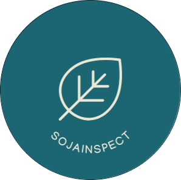

<h1 align="center">
  
</h1>

**Sumário**

- [Sobre o projeto](#sobre-o-projeto)
  - [Funcionalidades](#funcionalidades)
  - [Objetivo do projeto](#objetivo-do-projeto)
- [Tecnologias utilizada](#tecnologias-utilizada)
- [Endpoints da API](#endpoints-da-api)
- [Como executar o aplicativo em seu computador](#como-executar-o-aplicativo-em-seu-computador)
- [Limitações conhecidas da aplicação](#limitações-conhecidas-da-aplicação)


## Sobre o projeto

`API Rest` para o aplicativo _mobile_ [SojaInspect](https://github.com/viniciusft81/tcc-detector-praga-app), foi desenvolvido como parte do Trabalho de Conclusão de Curso (TCC). A API tem como objetivo contribuir com a detecção de pragas em plantações de soja com uso de inteligência artificial (IA) retornando a inferência ao aplicativo.

### Funcionalidades

- **Detecta se a imagem é de soja**: quando o usuário envia uma imagem da soja pelo aplicativo, a imagem será analisada por um modelo de IA que identifica se a imagem é de uma soja, se for uma soja, segue para o modelo de detecção de pragas.
- **Detecção de pragas e retorno da inferência**: caso for imagem de soja, irá para o modelo treinado previamente para identificar se há alguma praga na imagem fornecida e irá retornar quais pragas estão presente na planta para o aplicativo.

### Objetivo do projeto
O objetivo da criação do aplicativo `SojaInspect` é demonstrar a ideia de uma ferramenta acessível para o monitoramento de pragas. O aplicativo, se concentra em mostrar como as tecnologias de IA e mobile podem ser aplicadas no setor agrícola, incentivando a adoção de soluções tecnológicas no campo e contribuindo com a pesquisa acadêmica através da aplicação prática de modelos de IA. Este projeto é um exemplo de como a tecnologia pode resolver problemas reais na agricultura e o compromisso com a inovação e melhora contínua no setor agrícola.

## Tecnologias utilizada

- Python
- Flask
- FastAI
- Pre-commit
- Pylint
- Cerberus
- Banco de dados NoSQL (MongodB)

## Endpoints da API

| Método | Endpoint | Descrição do serviço |
|--------| -------- | -------------------- |
| POST | ip_localhost:3333/predictions | Recebe a imagem para fazer a predição |
| POST | ip_localhost:3333/feedback | Armazena no banco de dados a correção da inferência fornecida pelo usuário |

> Obs.: Em ip_localhost, substitua para o IP da sua máquina.

## Como executar o aplicativo em seu computador

1. Para obter o código fonte disponível neste repositório, execute o seguinte comando:

```ssh
cd ~
git clone https://github.com/viniciusft81/tcc-detector-praga-api.git
```
2. Crie um ambiente virtual e instale as dependência do projeto:
```ssh
cd tcc-detector-praga-api
python3 -m venv venv
source venv/bin/activate
pip3 install -r requirements.txt
```

3. Por fim, utilizando o comando abaixo, inicie a aplicação:
```ssh
gunicorn --config gunicorn_config.py app:app
```

## Limitações conhecidas da aplicação

- Como o `deploy` ficou comprometido por faltar memória ao subir a aplicação, visto que o modelo de IA consome bastante memória de instâncias. Com isso, não foi disponibilizado o `deploy` da API.